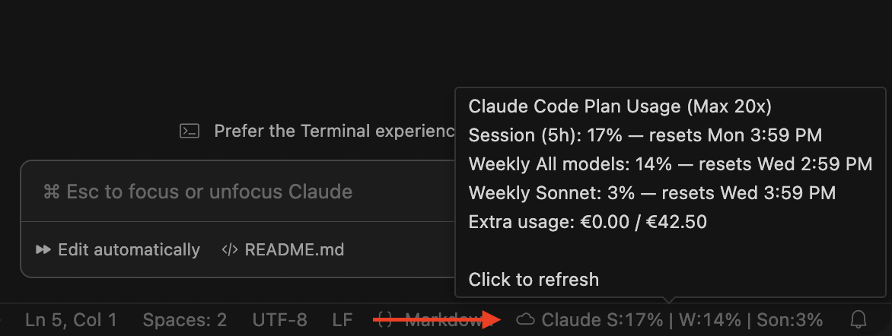

# Claude Code Status Bar

Cursor extension that displays your Claude Code plan usage limits directly in the status bar.

## Requirements

- **Cursor** 2.4.22+
- **Claude Code extension** must be installed and authorized (Pro or Max subscription)
- **macOS** Tahoe 26.2 (it will most likely work on earlier versions as well, but I haven’t tested it).

**Important!** There is currently no support for Windows or Linux. If the extension turns out to be in demand and I have some free time, I may add support later.

## What it shows

**Status bar** (always visible):
- **S** — Session (5-hour rolling window) usage %
- **W** — Weekly all models usage %
- **Son** — Weekly Sonnet-only usage %

**Tooltip** (on hover):
- Plan name and tier (e.g. "Max 20x")
- Detailed percentages with reset times
- Extra usage spend and monthly limit

The status bar item turns orange when session or weekly usage exceeds 80%.

## How to install

Install the Claude Code extension in Cursor and sign in to it. The Claude Code Status Bar extension will automatically retrieve the authentication data from the macOS Keychain. If this doesn’t happen, restart Cursor.

## How it works

1. Reads your OAuth token from **macOS Keychain** — the same credentials that Claude Code extension stores when you log in
2. No separate login required — if Claude Code is authorized in Cursor, this extension works automatically.

## Settings

1. Press **Cmd + Shift + P**.
2. Type **Open Settings** or **Preferences: Open Settings (UI)**.
3. Select **Preferences: Open Settings (UI)**.
4. The Settings window will open with a search field at the top. Type **Claude Code Status Bar** into the search.

| Setting | Default | Description |
|---------|---------|-------------|
| `claudeCodeStatusBar.refreshIntervalSeconds` | `60` | How often to refresh usage data (minimum 10 seconds) |
| `claudeCodeStatusBar.currencySymbol` | `""` (auto) | Currency symbol for extra usage (e.g. `€`, `$`, `£`). Empty = auto-detect from editor locale |

At the moment, the Claude API does not provide information about the billing plan currency, so the currency can be set manually in the extension settings. This setting does not affect anything except the currency shown in the tooltip for the Extra Usage item.

## Support me

If you like the extension, feel free to buy me a coffee via the link https://ko-fi.com/alexxxf